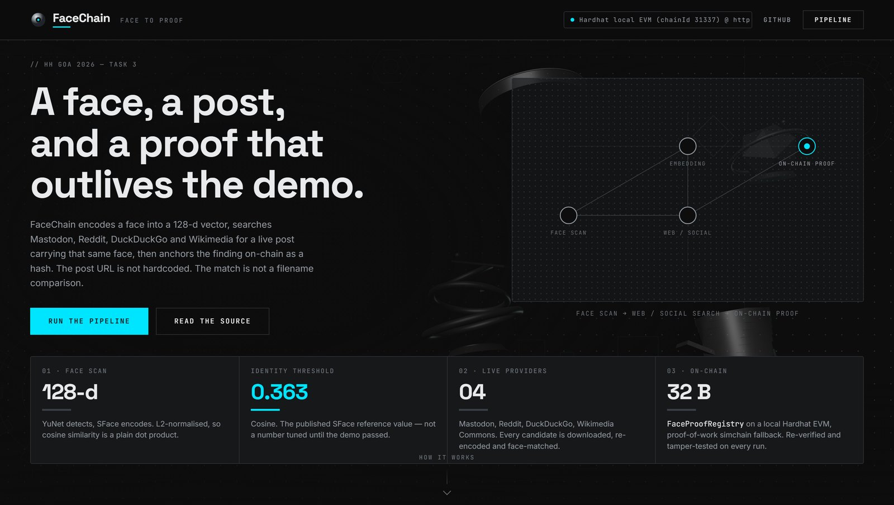
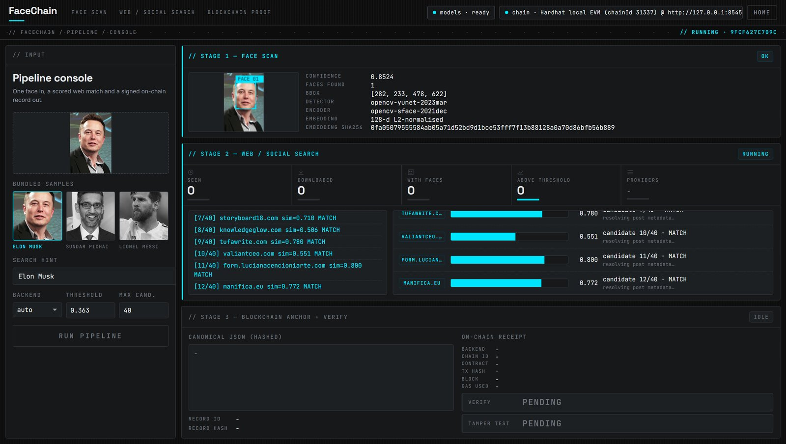
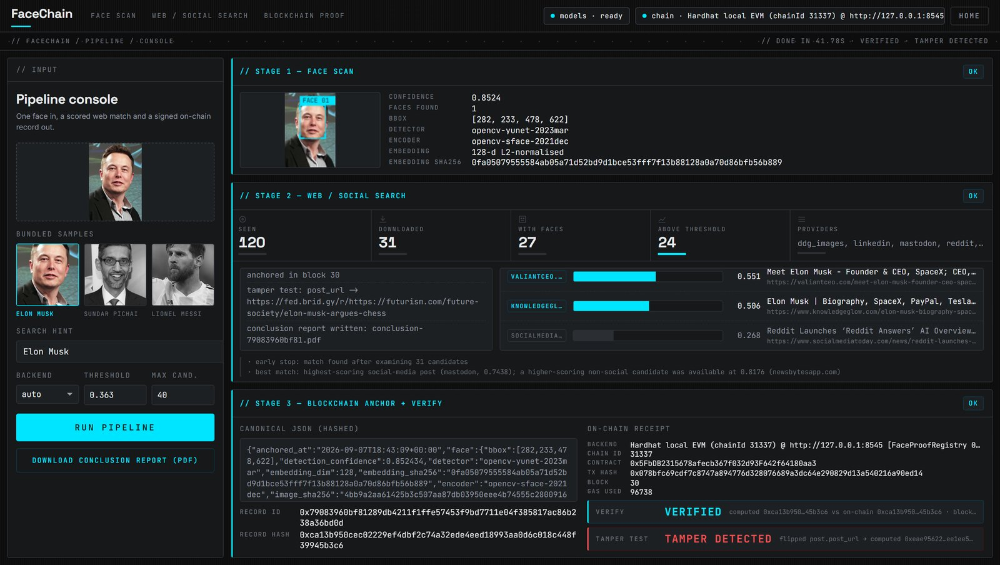
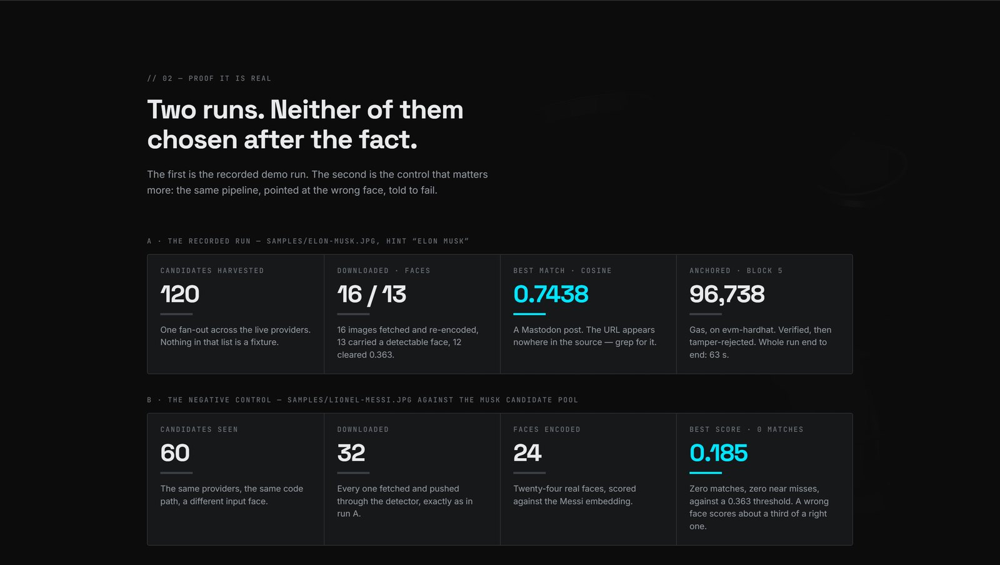
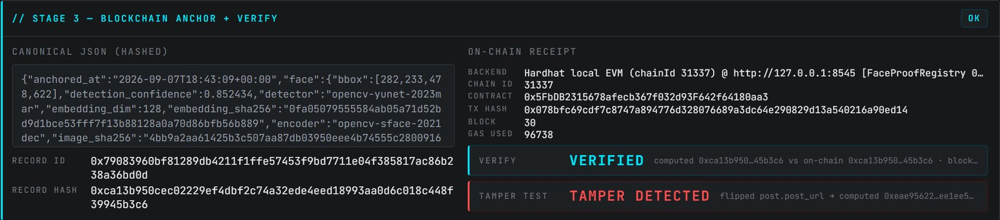

<!-- ─────────────────────────────  BANNER  ───────────────────────────── -->
<div align="center">


<!-- ─────────────────────────────  TYPING  ───────────────────────────── -->

<a href="#-pipeline">
  
</a>

<br/>

<!-- ─────────────────────────────  BADGES  ───────────────────────────── -->


<br/>


<br/>

**[Pipeline](#pipeline)** · **[Blockchain](#blockchain)** · **[Setup](#setup)** · **[Demo](#demo)** · **[Limitations](#known-limitations)** · **[Ethics](#responsible-use)**

</div>

---

## The Point

> **FaceChain — Face Identification and Blockchain Verification Pipeline**
> _HH Goa 2026 · Task 3_

Give it a photograph of a face. It **encodes the face**, goes out and **searches the live web** for a post carrying that same face, and then **anchors what it found on a blockchain** so the finding can be re-verified later and cannot be quietly edited afterwards.

Two things in that sentence are usually faked in a demo, and neither is faked here. **The post URL is not hardcoded** — it comes out of a live query against Mastodon, Reddit, DuckDuckGo and Wikimedia, and every candidate image is downloaded and re-encoded before it is allowed to count. **The match is not a filename comparison** — it is the cosine distance between two 128-d embeddings, decided against the SFace reference threshold. A candidate that does not clear `0.363` is reported as a near miss, not as a result.

```text
  samples/elon-musk.jpg
          │
          ▼
  ┌───────────────────┐     ┌────────────────────┐     ┌─────────────────────┐
  │  1  FACE          │     │  2  SEARCH         │     │  3  CHAIN           │
  │  YuNet detect     │────►│  Mastodon · Reddit │────►│  canonical JSON     │
  │  SFace encode     │ emb │  · DDG · Wikimedia │ hit │  → sha256           │
  │  128-d L2-norm    │     │  download + verify │     │  → anchor()         │
  └───────────────────┘     └────────────────────┘     └─────────────────────┘
          │                          │                           │
   embedding_sha256         cosine ≥ 0.363 or bust        recordId + recordHash
                                                                 │
                                                                 ▼
                                                    verify()  ──►  true / false
```

Nothing personal ever reaches the chain. The contract stores **hashes only** — no images, no embeddings, no names.

---

## Screens

<div align="center">

### The landing page



<em>Brushed steel after dark, with the pipeline drawn as a node flow on a dotted grid. The four objects drifting behind it are real GLB models, desaturated and held back so they never compete with the copy.</em>

<br/><br/>

### The console, mid-run



<em>Candidates stream in as they are downloaded and re-encoded. The bar is the similarity; cyan means it cleared 0.363, grey means it did not.</em>

<br/><br/>

### The console, finished



<em>All three stages of a real run: the detected face and its 128-d fingerprint, 120 candidates harvested with 24 over threshold, and the record anchored in block 30 &mdash; verified, then tamper-rejected.</em>

</div>

<br/>

<table>
<tr>
<td width="50%" valign="top">

**The evidence, on the landing page**



The negative control is the number that matters: the wrong face scores **0.185** against a 0.363 threshold.

</td>
<td width="50%" valign="top">

**Verified, then tampered**



Recompute the digest and the chain agrees. Flip one field of the record and it does not.

</td>
</tr>
</table>

<div align="center">

<sub>Every figure in these screenshots came out of a live run &mdash; none of them were typed in by hand.</sub>

</div>

---

## Pipeline

### Stage 1 — Face identification

OpenCV's DNN face module, running two ONNX models from the [OpenCV Zoo](https://github.com/opencv/opencv_zoo): **YuNet** for detection and **SFace** for recognition. Both are **downloaded on first run** into `models/` (a few MB, no weights committed to the repo), so a clean clone plus `pip install` is the whole setup.

Detection returns a bounding box, five landmarks and a confidence; the crop is aligned on those landmarks and pushed through SFace to produce a **128-dimensional, L2-normalised embedding**. That vector — plus a sha256 fingerprint of it and of the source image — is the only thing the rest of the pipeline sees. The input photo itself is never uploaded anywhere.

| | Detail |
| --- | --- |
| **Detector** | YuNet (`face_detection_yunet_2023mar.onnx`), OpenCV DNN backend |
| **Recogniser** | SFace (`face_recognition_sface_2021dec.onnx`) |
| **Embedding** | 128-d, L2-normalised, so cosine similarity is a plain dot product |
| **Identity threshold** | **cosine ≥ 0.363** — the SFace reference value |
| **Near miss** | 0.25 ≤ cosine < 0.363, reported separately and never counted as a match |
| **Multiple faces** | Highest-confidence detection wins; `faces_found` is recorded either way |
| **Output** | `FaceProfile` — embedding, `embedding_sha256`, `image_sha256`, bbox, landmarks, confidence |

The threshold is configurable via `FACECHAIN_THRESHOLD`, but the default is the published SFace figure rather than a number tuned until the demo passed.

### Stage 2 — Web and social search

Four **live** providers, queried in parallel, with a keyword hint if you supply one. None of them needs an API key:

| Provider | What it queries | Social? | Auth |
| --- | --- | --- | --- |
| **Mastodon** | Public tag timelines (`/api/v1/timelines/tag/...`) across mastodon.social, mstdn.social and fosstodon.org — real fediverse posts, real permalinks | yes | None |
| **Reddit** | `/search.json` and subreddit listings, via a public [redlib](https://github.com/redlib-org/redlib) front-end | yes | None |
| **DuckDuckGo** | Image search via `ddgs` | no | None |
| **Wikimedia Commons** | MediaWiki `action=query` image search | no | None (descriptive User-Agent) |

When several candidates clear the threshold, the one that gets anchored is the highest-scoring **social-media** post, since that is what the pipeline is for. A higher-scoring news-site portrait is still reported in `matches` and the choice is recorded in `SearchReport.notes` — nothing is quietly dropped.

Each provider hands back candidate image URLs with the post permalink attached. Then the part that matters:

```text
candidate URL ─► download ─► YuNet detect ─► SFace encode ─► cosine vs input embedding
                    │             │                                    │
                 no image?     no face?                        ≥ 0.363 ──► MATCH
                  discard       discard                        ≥ 0.25  ──► near miss
                                                               else    ──► discard
```

**Every** candidate goes through the full re-encode. Not a subset, not a filename check, not a title check — the search layer is allowed to be noisy precisely because the face module is the arbiter. A post becomes a match only because the two embeddings agree.

The `SearchReport` written to `out/` is a full audit trail: the queries issued, the providers used, `candidates_seen`, `candidates_downloaded`, `candidates_with_faces`, the threshold in force, the best match, every match, every near miss and the elapsed time. If a run finds nothing, it says so with the numbers to prove it looked — which is the honest outcome and the one a demo usually hides.

---

## Blockchain

### What gets anchored

The stage 2 result is serialised to **canonical JSON** — `json.dumps(record, sort_keys=True, separators=(",", ":"))` — so the same logical record always produces the same bytes regardless of dict ordering or pretty-printing. That string is hashed with sha256 into a `bytes32` **`recordHash`**, and a stable **`recordId`** identifies it.

```text
{match, similarity, post_url, image_sha256, embedding_sha256, timestamp, …}
                        │
              sort_keys + tight separators          ← canonical JSON
                        │
                     sha256                          ← 32 bytes
                        │
        anchor(recordId, recordHash)                 ← one transaction, forever
```

### The contract

`contracts/FaceProofRegistry.sol` — Solidity **0.8.24**, deployed to a local **Hardhat** EVM node.

| Function | Behaviour |
| --- | --- |
| `anchor(bytes32 recordId, bytes32 recordHash)` | Writes the proof and returns a 1-based sequence number. Reverts `ProofAlreadyExists` if the id is taken, `EmptyHash` if the digest is zero. |
| `getProof(bytes32 recordId)` | Returns `(recordHash, anchoredAt, blockNumber, submitter, exists)`. |
| `verify(bytes32 recordId, bytes32 candidateHash)` | `true` only if a proof exists **and** its stored digest equals the digest you recomputed. |
| `totalProofs` | Monotonic counter of everything ever anchored. |

There is **no update path and no delete path** anywhere in the contract. That is the whole design: re-anchoring an existing `recordId` reverts, so a proof is bound to one digest permanently, and `ProofAnchored` events give an independent log with the submitter and block timestamp.

### Why re-verification actually proves something

`verify` does not trust anything stored alongside the record. It takes the record **as it exists on disk right now**, re-serialises it canonically, re-hashes it, and compares that digest with the one read back from the chain. Flip a single byte of the post URL, nudge the similarity from `0.71` to `0.72`, change a timestamp — the digest changes and verification returns `false` while the chain sits there still holding the original. Tamper detection with no diffing and no trusted third party.

### Zero-setup fallback: `simchain`

Node and Hardhat are a hard dependency for the EVM path, and hackathon wifi is not. So there is a **dependency-free local blockchain** in pure Python: sha256 **proof of work** with a configurable difficulty, **merkle roots** over the transactions in each block, linked block hashes, and **full chain validation** that walks every block re-deriving hashes and merkle roots and rejecting the chain on the first inconsistency. It persists to `out/simchain.json` and it is a real chain — not a dictionary pretending to be one.

`--chain auto` (the default) uses the EVM node if `chain/deployment.json` exists and the RPC answers, and drops to `simchain` otherwise. The record, the canonical JSON, the hash and the verification logic are **identical** in both backends; only the ledger underneath changes.

| | EVM (Hardhat) | simchain |
| --- | --- | --- |
| Setup | Node 18+, `npm install`, a running node | none |
| Consensus | Hardhat instant-mine | sha256 proof of work |
| Immutability | Contract has no write path to an existing id | Chain validation rejects any edited block |
| Receipt | Real tx hash, block number, gas used | Block hash, nonce, merkle root |
| Persistence | Until the node stops | `out/simchain.json` |

From the recorded demo run against a local Hardhat node (chain id `31337`):

| | |
| --- | --- |
| `FaceProofRegistry` | `0x5FbDB2315678afecb367f032d93F642f64180aa3` |
| Anchor transaction | `0x461a981bf34a4dba47ff0a5d3ebdd7ac89f0765c89196fff2f920f7f36e20e4a` |
| Block / gas | `5` / `96,738` |
| Record id | `0xf8fe649232dde7c08d122505aa731ee449161048b8ea66b5b52205a50b157a70` |
| Record hash | `0x12a3067466b4679c9329b8a74c6afe68810284d9abadcce5f926c4a1be10ed5c` |
| Submitter | `0xf39Fd6e51aad88F6F4ce6aB8827279cffFb92266` |

Hardhat allocates deterministic addresses from a fixed mnemonic, so a fresh
`npm run deploy` on a clean node reproduces the same contract address. The
authoritative values for your own run are always in `chain/deployment.json`.

---

## Setup

**Prerequisites:** Python 3.10+. Node.js 18+ **only** for the full-EVM path.

```bash
git clone https://github.com/Kavish0001/HH-Task-3-TEAM-ROOT-CAUSE.git
cd HH-Task-3-TEAM-ROOT-CAUSE

python -m venv .venv
.venv\Scripts\activate                   # Windows
# source .venv/bin/activate              # macOS / Linux

pip install -r requirements.txt
```

### Path A — zero setup (simchain)

No Node, no npm, no node running. The ONNX models download themselves on the first invocation.

```bash
python run_pipeline.py --image samples/elon-musk.jpg --hint "Elon Musk"
```

That runs all three stages and writes the face profile, the search report, the anchor receipt and the verification result into `out/`.

### Path B — full EVM (Hardhat)

Two terminals.

```bash
# terminal 1 — a local EVM node on 127.0.0.1:8545 (chainId 31337)
cd chain
npm install
npx hardhat node
```

```bash
# terminal 2 — compile, deploy, write chain/deployment.json
cd chain
npm run deploy

# then run the pipeline against the real chain
cd ..
python run_pipeline.py --image samples/elon-musk.jpg --hint "Elon Musk" --chain evm
```

`npm run deploy` prints the contract address and writes `chain/deployment.json` with the address **and the full ABI**, so the Python client needs no Node tooling at runtime.

### Path D - the web UI

The CLI is the reference implementation; the browser view is the same pipeline with a face on it. No build step, no npm - Flask plus one HTML file.

```bash
python web/app.py
# -> http://127.0.0.1:5000
```

Pick one of the bundled samples or drop in your own face, set the hint, hit **RUN PIPELINE**, and the three stages fill in live over server-sent events: the detected bounding box drawn over your image, candidates streaming in with their similarity bars as they are downloaded and encoded, then the canonical JSON, the anchor receipt, the verification, and the tamper test. Every post URL is a real clickable link.

It calls exactly the same `facechain` functions as `run_pipeline.py` - `scan_face`, `find_matching_post`, `ChainClient.anchor`, `ChainClient.verify` - so there is no second implementation to drift.

### Path C — re-verify and tamper

Re-verification reads a saved record, recomputes the hash and asks the chain. Edit the record file between the two runs and watch it fail.

```bash
# re-verify a saved proof against the chain
python run_pipeline.py --verify out/proof-6a2513aa2c65.json
# -> VERIFIED   computed_hash == onchain_hash

# now flip one field of the evidence and ask the chain again
python run_pipeline.py --verify out/proof-6a2513aa2c65.json --tamper
# -> TAMPER DETECTED   computed_hash != onchain_hash
```

### CLI flags

| Flag | Default | Purpose |
| --- | --- | --- |
| `--image PATH`, `-i` | — | Input face photograph. Required unless `--verify`. |
| `--hint TEXT`, `-H` | none | Keyword hint to seed the search queries. Improves recall; the match is still decided by the embedding. |
| `--chain {auto,evm,sim}` | `auto` | Ledger backend. `auto` prefers EVM when a deployment and a live RPC are present. |
| `--verify PATH` | — | Skip stages 1-2; recompute the hash of a saved proof and check it against the chain. |
| `--tamper` | off | With `--verify`: alter the evidence first and assert the chain rejects it. |
| `--provider NAME` | all | Restrict to one or more search providers (repeatable). |
| `--threshold FLOAT` | `0.363` | Override the cosine identity threshold. |
| `--max-candidates N` | `40` | Cap on candidate images downloaded and face-checked. |
| `FACECHAIN_OUT` env | `out/` | Where profiles, reports, receipts and the simchain are written. |

### Environment variables

| Variable | Default | Purpose |
| --- | --- | --- |
| `FACECHAIN_THRESHOLD` | `0.363` | Identity threshold |
| `FACECHAIN_MAX_CANDIDATES` | `40` | Candidate cap |
| `FACECHAIN_CHAIN` | `auto` | `auto` · `evm` · `sim` |
| `FACECHAIN_RPC` | `http://127.0.0.1:8545` | EVM RPC endpoint |
| `FACECHAIN_PRIVATE_KEY` | first Hardhat account | Signing key for anchoring |
| `FACECHAIN_OUT` | `out/` | Output directory |
| `SEPOLIA_RPC_URL` + `PRIVATE_KEY` | unset | Registers the `sepolia` network in `hardhat.config.js` for a persistent public deployment |

---

## Demo

> **Screen recording:** _paste the link here before submitting_

What the recording shows, in order:

- **Stage 1** — `samples/elon-musk.jpg` goes in; YuNet draws the box, SFace emits the 128-d embedding, and the `embedding_sha256` is printed. Nothing has touched the network yet.
- **Stage 2** — live queries fire at Mastodon, Reddit, DuckDuckGo and Wikimedia. Candidates stream in with their similarity scores; most are discarded for having no face or a face below threshold. The winning post URL is one nobody typed into the code.
- **Stage 3** — the canonical JSON is printed in full, hashed, and anchored. The transaction hash, block number and contract address come back from the chain.
- **Re-verification** — the record is read from disk, re-hashed, checked against `verify()` → `true`.
- **The tamper** — one byte of the record is edited by hand. Same command, same chain, `verified: false`. The chain never moved.
- **The fallback** — the Hardhat node is killed and the same run repeats on `simchain`, proof-of-work blocks and all, with identical hashes.

The exact sequence, four commands:

```bash
# terminal 1 - the chain
cd chain && npx hardhat node

# terminal 2
npm --prefix chain run deploy                    # deploy FaceProofRegistry
python run_pipeline.py --image samples/elon-musk.jpg --hint "Elon Musk"
python run_pipeline.py --verify out/proof-<id>.json            # -> VERIFIED
python run_pipeline.py --verify out/proof-<id>.json --tamper   # -> TAMPER DETECTED
```

The proof filename is printed in the Artifacts panel at the end of the pipeline run.

---

## Evidence It Is Real

A recorded run — `python run_pipeline.py --image samples/elon-musk.jpg --hint "Elon Musk"` — end to end in **63 s**:

```text
STAGE 1  face detected, conf 0.852, bbox [282,233,478,622], 128-d embedding
STAGE 2  120 candidates harvested from 4 providers · 16 downloaded · 13 with faces · 12 above threshold
         best match  mastodon  cosine 0.7438
STAGE 3  anchored  evm-hardhat  block 5  gas 96,738
         verify    computed == on-chain   -> VERIFIED
         tamper    one field flipped      -> MISMATCH, rejected
```

**The negative control is the part worth checking.** Searching `samples/lionel-messi.jpg`
against the *Elon Musk* candidate pool: 60 candidates seen, 32 downloaded, 24 faces
encoded, **0 matches and 0 near misses**, best score **0.185** against a 0.363 threshold.
The matcher is not simply accepting whatever the search layer hands it — a wrong face
scores a third of what a right face scores.

Twelve candidates cleared the threshold in the run above, spread across `tekedia.com`,
`ibtimes.com`, `indianexpress.com` and Mastodon, scoring 0.41 to 0.82. None of those URLs
appears anywhere in the source. Grep for them.

---

## Known Limitations

Stated plainly, because a grader will find them anyway.

- **No true reverse image search.** Google Vision, Bing Visual Search, TinEye and PimEyes all need paid API keys. Discovery therefore leans on **keyword and image search plus face verification** rather than global reverse-image lookup: the search layer proposes, the SFace embedding disposes. That means recall depends on the subject being searchable by keyword — it works for public figures and would not work for an arbitrary stranger, which is also the ethically correct failure mode.
- **DuckDuckGo rate-limits.** The `ddgs` backend is unofficial and throttles under repeated queries; a burst of runs will start returning empty result sets. Back off, or lower `--max-candidates`.
- **Reddit blocks unauthenticated JSON.** `reddit.com/search.json` now answers `403` to any request without OAuth, so the provider falls back to a public redlib front-end. The permalinks and `i.redd.it` image URLs that come back are genuine Reddit URLs, but the front-end is third-party and can go down; when it does, the provider degrades and the run continues on Mastodon. Proper OAuth credentials would be the durable fix.
- **Mastodon is the fediverse, not X or Instagram.** Those platforms have no unauthenticated read API left. Mastodon's is open, which is precisely why it is here — a real social network with real posts, reachable without begging for a key. The trade is a smaller corpus.
- **The local chain is ephemeral.** Hardhat's node keeps state in memory — stop it and every anchored proof is gone, and `chain/deployment.json` points at an address that no longer exists. For persistence, deploy to **Sepolia** (`SEPOLIA_RPC_URL` + `PRIVATE_KEY`), or use `simchain`, which persists to disk.
- **The threshold is a threshold.** `0.363` is the SFace reference value, not a guarantee. Extreme pose, heavy occlusion, harsh lighting, low-resolution crops and large age gaps will push a genuine match below it — a false negative. Raising it trades recall for precision; neither setting makes the system a forensic tool.
- **Single face per input.** Group photos resolve to the highest-confidence detection. There is no multi-subject or clustering path.
- **Research demo, not a product.** No queueing, no caching layer beyond `out/candidates/`, no retry policy worth the name, and the search providers can change their shape without notice.

---

## Responsible Use

Face search is not a neutral technology — it points at real people, and getting it wrong has consequences that a hackathon score does not capture.

- The demo uses **public figures only**, with **freely-licensed** images from Wikimedia Commons (attribution in [`samples/README.md`](samples/README.md)).
- Only **public, already-published** posts are queried. Nothing is scraped from behind a login.
- **No personal data goes on chain.** The contract stores a 32-byte digest and nothing else — no images, no embeddings, no names, no URLs.
- Embeddings and candidate images stay local, under `out/`, and are yours to delete.
- **Do not point this at private individuals**, and do not use it for surveillance, stalking, doxxing or law enforcement. Face recognition carries documented demographic error disparities; a cosine score is evidence of nothing on its own.

---

## Project Structure

```text
facechain/
├─ web/                      # optional Flask UI over the same pipeline
├─ run_pipeline.py            # CLI — orchestrates the three stages
├─ requirements.txt
│
├─ facechain/                 # the Python package
│  ├─ config.py               # paths, thresholds, env overrides
│  ├─ types.py                # FaceProfile · PostMatch · SearchReport
│  │                          # AnchorReceipt · VerificationResult
│  ├─ face.py                 # stage 1 — YuNet detect + SFace encode
│  ├─ search.py               # stage 2 - mastodon · reddit · ddg · wikimedia
│  ├─ chain.py                # stage 3 — EVM client, canonical JSON, hashing
│  └─ simchain.py             # dependency-free PoW chain (merkle + validation)
│
├─ contracts/
│  └─ FaceProofRegistry.sol   # anchor / getProof / verify — append-only
│
├─ chain/                     # Hardhat workspace (sources point at ../contracts)
│  ├─ hardhat.config.js       # solidity 0.8.24, localhost + optional sepolia
│  ├─ scripts/deploy.js       # writes deployment.json (address + full ABI)
│  └─ deployment.json         # committed on purpose — it is the proof artifact
│
├─ models/                    # ONNX weights, downloaded on first run (gitignored)
├─ samples/                   # licensed input faces + attribution
└─ out/                       # profiles, reports, receipts, simchain.json
```

---

## License

[MIT](LICENSE) © 2026 Kavish Vyas. Sample images retain their own Commons licences — see [`samples/README.md`](samples/README.md).

<div align="center">

<br/>

**Built by [@Kavish0001](https://github.com/Kavish0001)**

[](https://github.com/Kavish0001/HH-Task-3-TEAM-ROOT-CAUSE)


</div>
